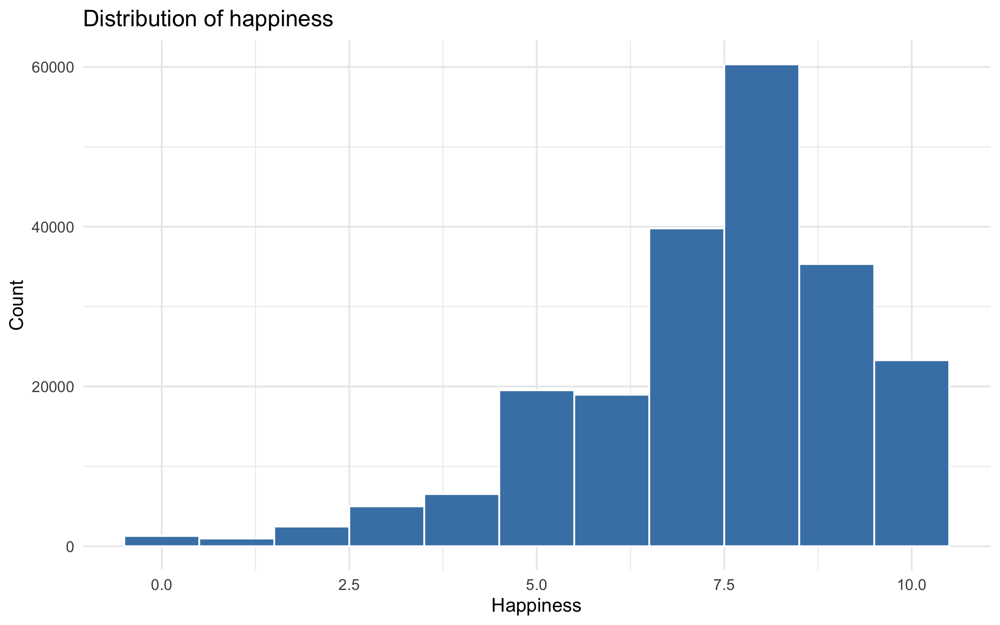
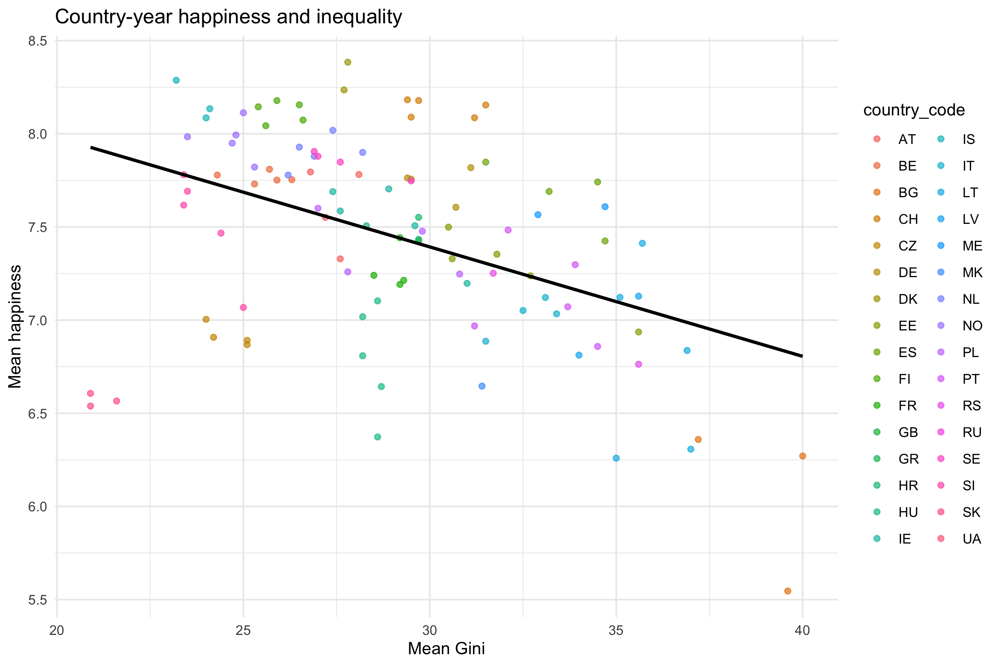
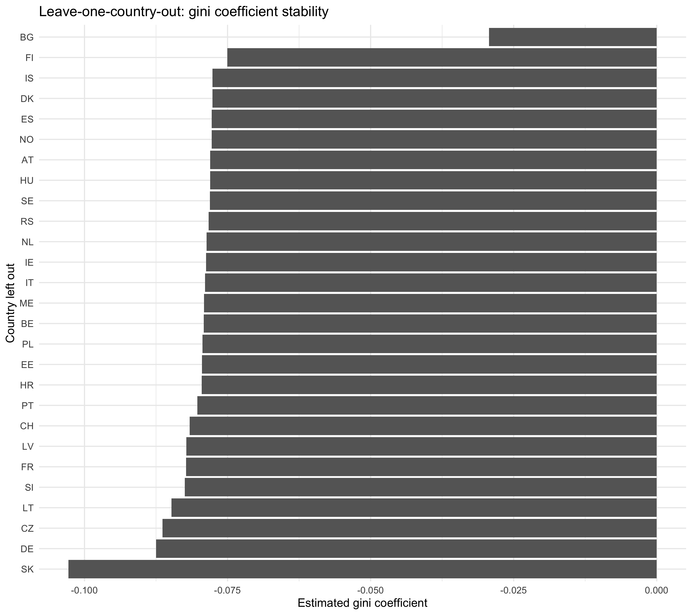

## Research question and scope

- **Question:** How is inequality associated with happiness in Europe?
- **Interpretation goal:** Observational association (not causal identification)
- **Primary outcome:** `happy`
- **Primary exposure:** `gini`
- **Controls:** `unemployment_rate`, `agea`, `hinctnta`, `evmar`
- **Population:** European countries, ESS rounds 7-11 (survey years 2014+)
- **Missing-data policy:** retain all rows for descriptives, complete cases for models

## Pipeline and canonical dataset

1. `scripts/01_collect_eurostat_macro.R`
2. `scripts/02_collect_ess_micro.R`
3. `scripts/03_merge_micro_macro.R`
4. `scripts/04_analysis_outline.R`
5. Canonical analysis dataset: `data/processed/analysis_dataset.csv`

## Data quality and coverage

```{r}
library(readr)
library(dplyr)

diag <- read_csv("data/processed/analysis_diagnostics.csv", show_col_types = FALSE)
diag
```

## Stage A: descriptive diagnostics

```{r}
library(ggplot2)


```

```{r}
#| fig-alt: "Scatterplot of country-year mean happiness versus mean gini"

```

## Stage B/C/D: model workflow

```{r}
models <- read_csv("output/tables/model_results.csv", show_col_types = FALSE)
models %>%
  filter(term %in% c("gini", "gini_lag1", "log_gini", "I(gini^2)")) %>%
  select(model, term, estimate, std_error, p_value, n)
```

## Robustness and sensitivity

- Alternative transformations (`log(gini)`, quadratic term)
- Lagged macro alignment (`gini_lag1`, `unemployment_rate_lag1`)
- Balanced-panel restriction
- Leave-one-country-out influence checks
- Heterogeneity checks by income and age interactions

```{r}
#| fig-alt: "Leave-one-country-out gini coefficient stability plot"

```

## Interpretation and limitations

- Results are interpreted as **associations**, not causal effects.
- Country/year fixed effects reduce confounding from time-invariant country differences and common time shocks.
- Remaining limitations include omitted variable bias, measurement comparability, and potential non-random missingness.

## Reproducibility and acceptance checks

- End-to-end run via `source("scripts/00_master.R")`
- No broken path references (`data/processed`, `output/tables`, `output/figures`)
- Reproducible diagnostics and model tables generated automatically
